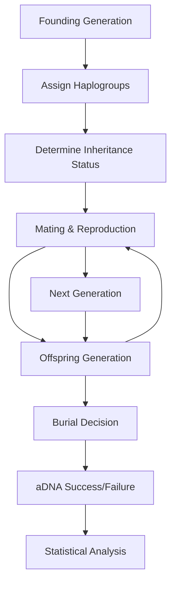

# Agent-Based Simulation for Inheritance Pattern Analysis

## Data Preparation

The archaeological aDNA data used in this analysis comes from the Cambridgeshire aDNA summary dataset available at: https://docs.google.com/spreadsheets/d/1t5xgyfdI6Ix_OLhg1c_x5VofATUbrhkw/edit?gid=759545336#gid=759545336

### Data Cleaning Process

The raw data (`single_dataset.csv`) undergoes the following cleaning steps using `clean_dataset.py`:

1. **Site Filtering**: Records from Arbury site are excluded from analysis
2. **Age Filtering**: Records with Adult column value "N" (non-adults) are removed
3. **Site Standardization**: Site ID values are simplified to 5 categories:
   - `Knobbs` (combines Knobbs 1, 2, and 3)
   - `NW_Cambridge` (Northwest Cambridge Site IV)
   - `Vicar_Farm` (Vicar's Farm)
   - `Fenstanton` (both Dairy Crest and Cambridge Road locations)
   - `Duxford`
4. **Column Removal**: Sex determination column is removed (we use DNA sex determination if possible, otherwise default to skeletal)
5. **Kinship Formatting**: "Sample ID for kin" values are converted to Python list format for easier parsing

To clean the data:
```bash
python clean_dataset.py single_dataset.csv > cleaned_dataset.csv
```

NB: The cleaned dataset stores kinship relationships in the "Sample ID for kin" column as string representations of Python lists. For example:
  - "[]" for no kinship
  - "['VIC016']" for single relationship
  - "['NWC007', 'NWC009', 'NWC004']" for multiple relationships

  When pandas reads the CSV, these values are loaded as strings, not actual Python lists. To convert them back to usable list objects, you use `ast.literal_eval()`:

```python
  import pandas as pd
  import ast

  df = pd.read_csv('cleaned_dataset.csv')
  kin_list = ast.literal_eval(df.iloc[0]['Sample ID for kin'])
```

## Overview

This document describes the agent-based model developed to test five inheritance systems against archaeological aDNA data from Roman-era Cambridgeshire sites. The model uses Approximate Bayesian Computation (ABC) to determine the most likely inheritance patterns for each archaeological site.


## Model Architecture

### Agent-Based Framework

The simulation models individual people as agents within a population over multiple generations. Each agent has:

- **Demographics**: Sex, age, generation
- **Genetics**: Y-chromosome and mtDNA haplogroups
- **Social Status**: Inheritance status, burial location
- **Relationships**: Parent-offspring, kinship networks

### Inheritance Systems Tested

In a patrilocal system, men stay put and women move in → within a cemetery you expect low Y-chr diversity, higher mtDNA diversity.
In a matrilocal system, women stay and men move in → low mtDNA diversity, higher Y-chr diversity.

1. **Strongly Patrilineal** (90% male inheritance)
   - Theoretical prediction: Y-diversity = 0, high mtDNA diversity
   - Expected kinship: Many father-son pairs, few female-female relationships

2. **Weakly Patrilineal** (70% male inheritance)
   - Mixed pattern with patrilineal bias

3. **Balanced** (50% male/female inheritance)
   - Equal inheritance opportunities regardless of sex

4. **Weakly Matrilineal** (70% female inheritance)
   - Mixed pattern with matrilineal bias

5. **Strongly Matrilineal** (90% female inheritance)
   - Theoretical prediction: Y-diversity = 1, low mtDNA diversity
   - Expected kinship: Many mother-daughter pairs, few male-male relationships

## Implementation Details

### Configuration Files

The model uses two configuration files to manage parameters:

#### Site-Specific Parameters (`site_parameters.py`)
Population sizes per generation based on archaeological evidence:

```python
SITE_PARAMETERS = {
    'Duxford': {'population_per_generation': 25},      # 20-30 people
    'NW_Cambridge': {'population_per_generation': 25}, # 20-30 people
    'Vicar_Farm': {'population_per_generation': 40},   # 30-50 people
    'Fenstanton': {'population_per_generation': 30},   # up to 30 people
    'Knobbs': {'population_per_generation': 40}        # 30-50 people
}
```

#### Global Parameters (`global_parameters.py`)
Simulation-wide settings and ABC configuration:

```python
# Burial and preservation
BURIAL_PROBABILITY = 0.8    # Probability of burial in cemetery
ADNA_SUCCESS_RATE = 0.7     # DNA extraction success rate

# ABC model selection
ABC_ACCEPTANCE_QUANTILE = 0.05  # Top 5% of simulations accepted
DEFAULT_SIMULATIONS_PER_SYSTEM = 100

# Distance weights for ABC comparison
DISTANCE_WEIGHTS = {
    'y_diversity': 2.0,           # High importance - genetic discriminator
    'mt_diversity': 2.0,          # High importance - genetic discriminator
    'prop_father_son': 1.5,       # Medium - kinship evidence
    'prop_mother_daughter': 1.5,  # Medium - kinship evidence
    'sex_ratio': 1.0,             # Standard - demographic info
    # ... additional weights
}

# Inheritance system definitions
INHERITANCE_SYSTEMS = {
    'strongly_patrilineal': {'male_prob': 0.9, 'female_prob': 0.1},
    'weakly_patrilineal': {'male_prob': 0.7, 'female_prob': 0.3},
    'balanced': {'male_prob': 0.5, 'female_prob': 0.5},
    'weakly_matrilineal': {'male_prob': 0.3, 'female_prob': 0.7},
    'strongly_matrilineal': {'male_prob': 0.1, 'female_prob': 0.9}
}
```

### Agent Lifecycle



### Key Statistics Calculated

#### Haplotype Diversity (Nei's Formula)
```
H = (n/(n-1)) * (1 - Σp²)
```
Where n = sample size, p = frequency of each haplogroup

#### Kinship Relationship Ratios
- Father-son pairs / total relationships
- Mother-daughter pairs / total relationships
- Same-sex vs cross-sex kinship patterns
- Male vs female kinship frequency

#### Population Structure Metrics
- Sex ratios in burials
- Inheritance patterns by sex
- Haplogroup sharing within sites

## Running the Analysis

### Command-Line Interface

The main analysis script supports flexible execution options:

```bash
# Usage: python run_full_analysis.py [iterations] [site_name]

# Examples:
python run_full_analysis.py                    # All sites, default iterations (100)
python run_full_analysis.py 50                 # All sites, 50 iterations
python run_full_analysis.py 200 Duxford        # Only Duxford, 200 iterations
python run_full_analysis.py 100 "Knobbs 1"     # Only Knobbs 1, 100 iterations
```

**Available sites:**
- `Duxford` - Early Roman farmstead (100-125 CE)
- `NW_Cambridge` - Mid-Roman cemetery (150-250 CE)
- `Vicar_Farm` - Late Roman farm (270-420 CE)
- `Fenstanton` - Large farm complex (40-400 CE)
- `Knobbs` - Late Roman farm (275-400 CE)

### Quick Testing

For rapid testing and validation:

```bash
# Test single site with few iterations (fast)
python run_full_analysis.py 10 Duxford

# Test parameter changes
python run_full_analysis.py 25 "Vicar_Farm"
```

### Output Files

The analysis generates multiple CSV files for each site analyzed:

#### 1. Main Results (`abc_results_[site].csv`)
- Best inheritance system and evidence strength
- Posterior probabilities for all 5 systems
- Bayes factors for model comparison
- ABC acceptance statistics

#### 2. Site Statistics (`observed_stats_[site].csv`)
- Observed genetic diversity measures
- Kinship ratios (father-son, mother-daughter)
- Sex ratios and demographic data

#### 3. Simulation Data (`simulation_summaries_[site].csv`)
- Complete summary statistics for every simulation
- Organized by inheritance system and run ID
- Useful for validation and detailed analysis

#### 4. System Summaries (`system_aggregates_[site].csv`)
- Mean and standard deviation by inheritance system
- Statistical patterns across simulations

#### 5. Combined Analysis (when running all sites)
- `site_analysis_summary.csv` - Results for all sites
- `inheritance_analysis_visualization.png` - Charts and plots
- `inheritance_analysis_report.txt` - Detailed text report


### Data Requirements

Before running analysis, ensure you have:

1. **Raw data file**: `single_dataset.csv` (from Google Sheets source)
2. **Cleaned data**: Generate using `python clean_dataset.py single_dataset.csv > cleaned_dataset.csv`
3. **Python environment**: See requirements in repository

## ABC Model Selection Framework

### What is ABC Rejection Sampling?

ABC (Approximate Bayesian Computation) is a **likelihood-free** Bayesian method used when the likelihood function is intractable or too complex to compute directly. Instead of calculating exact probabilities, it uses **simulation-based inference**.

### Core ABC Algorithm

```python
# Step 1: Generate many simulations for each inheritance system
for system in ['strongly_patrilineal', 'weakly_patrilineal', 'balanced',
               'weakly_matrilineal', 'strongly_matrilineal']:
    for i in range(100):  # 100 simulations per system
        simulation_result = run_simulation(system)
        sim_statistics = calculate_summary_statistics(simulation_result)

        # Step 2: Calculate distance from observed data
        distance = calculate_distance(sim_statistics, observed_statistics)

        # Store results
        distances.append(distance)
        systems.append(system)
```

### Distance Calculation

The model compares simulated statistics to observed archaeological data using **weighted Euclidean distance**:

```python
def calculate_distance(sim_stats, obs_stats, weights):
    distance = 0.0
    total_weight = 0.0
    for key, weight in weights.items():
        if key in both datasets:
            # Normalize by observed value to handle different scales
            if obs_stats[key] != 0:
                normalized_diff = abs(sim_stats[key] - obs_stats[key]) / abs(obs_stats[key])
            else:
                normalized_diff = abs(sim_stats[key])
            distance += weight * normalized_diff
            total_weight += weight
    return distance / total_weight
```

**Key statistics compared with weights (from `global_parameters.py`):**
- `y_diversity`: Y-chromosome diversity (weight = 2.0) - Primary genetic discriminator
- `mt_diversity`: mtDNA diversity (weight = 2.0) - Complementary genetic signal
- `prop_father_son`: Father-son relationship ratio (weight = 1.5) - Direct kinship evidence
- `prop_mother_daughter`: Mother-daughter relationship ratio (weight = 1.5) - Direct kinship evidence
- `sex_ratio`: Male/female burial ratio (weight = 1.0) - Demographic information
- `prop_y_matches`: Y-chromosome sharing in kinship pairs (weight = 1.0) - Quality control
- `prop_mt_matches`: mtDNA sharing in kinship pairs (weight = 1.0) - Quality control
- `prop_inheritors`: Inheritance frequency (weight = 0.5) - Model artifact

### Rejection Step

```python
# Step 3: Accept only the closest simulations
epsilon = np.quantile(distances, 0.05)  # Accept top 5% of simulations
accepted_mask = distances <= epsilon
accepted_systems = systems[accepted_mask]
```

**In our analysis:**
- **500 total simulations** per site (100 per inheritance system)
- **25 simulations accepted** (5% acceptance rate)
- **ε (epsilon) threshold** = 5th percentile of distances

### Posterior Probability Calculation

```python
# Step 4: Calculate posterior probabilities from accepted simulations
for system in unique_systems:
    # Count how many accepted simulations came from each system
    count = np.sum(accepted_systems == system)
    # Posterior = proportion of accepted simulations from this system
    posteriors[system] = count / len(accepted_systems)
```

### Example: Duxford Site Analysis

#### Input Data:
- **500 simulations total** (100 per system, configurable via command line)
- **25 accepted** (ε = 0.2005, top 5% acceptance rate)

#### Accepted Simulations by System:
```
strongly_patrilineal:  9 accepted / 25 total = 0.36 posterior (36%)
weakly_patrilineal:    7 accepted / 25 total = 0.28 posterior (28%)
balanced:              2 accepted / 25 total = 0.08 posterior (8%)
weakly_matrilineal:    2 accepted / 25 total = 0.08 posterior (8%)
strongly_matrilineal:  5 accepted / 25 total = 0.20 posterior (20%)
```

#### Bayes Factors:
```python
prior_prob = 1.0 / 5 = 0.20  # Uniform prior over 5 systems
bayes_factors = {
    'strongly_patrilineal': 0.36 / 0.20 = 1.80,
    'weakly_patrilineal': 0.28 / 0.20 = 1.40,
    'balanced': 0.08 / 0.20 = 0.40,
    'weakly_matrilineal': 0.08 / 0.20 = 0.40,
    'strongly_matrilineal': 0.20 / 0.20 = 1.00
}
```

### Interpretation

The **posterior probability** represents: *"Given the observed archaeological data, what is the probability that this inheritance system generated the patterns we see?"*

For Duxford:
- **36% chance** the site follows strongly patrilineal inheritance
- **28% chance** weakly patrilineal
- **20% chance** strongly matrilineal
- **8% chance each** for balanced or weakly matrilineal

### Why ABC Rejection Sampling?

#### Advantages:
1. **Model-free**: No need to specify complex likelihood functions
2. **Flexible**: Can incorporate any summary statistics
3. **Realistic**: Uses full simulation model with all complexities
4. **Interpretable**: Direct comparison of simulation outputs to data

#### Challenges:
1. **Computational cost**: Requires many simulations
2. **Curse of dimensionality**: Performance degrades with many statistics
3. **Choice of summary statistics**: Must capture relevant patterns
4. **Acceptance rate**: Too strict = few samples, too loose = poor approximation

## Results Summary

### Site Analysis Results

| Site | Best System | Posterior Prob | Evidence Strength | Key Features |
|------|-------------|----------------|-------------------|--------------|
| **Duxford** | Strongly patrilineal | 0.36 | Weak | High Y & mtDNA diversity, 7 kinship pairs |
| **Knobbs 3** | Weakly patrilineal | 0.36 | Weak | Small sample, 3M/2F ratio |
| **Fenstanton-Cambridge Road** | Strongly matrilineal | 0.32 | Weak | High Y diversity, 2M/3F |
| **Northwest Cambridge** | Strongly patrilineal | 0.32 | Weak | High diversity, 6M/4F |
| **Vicar's Farm** | Weakly matrilineal | 0.28 | Inconclusive | 4M/12F, mother-daughter pairs |
| **Arbury** | Strongly matrilineal | 0.24 | Inconclusive | Small sample, father-son pair |
| **Knobbs 1** | Balanced | 0.24 | Inconclusive | High mtDNA diversity |
| **Fenstanton-Dairy Crest** | Strongly matrilineal | 0.24 | Inconclusive | Moderate Y diversity |
| **Knobbs 2** | Strongly patrilineal | 0.24 | Inconclusive | Large sample, low diversity |

### Overall Patterns

#### System Distribution
- **Strongly matrilineal**: 3 sites (33%)
- **Strongly patrilineal**: 3 sites (33%)
- **Weakly patrilineal**: 1 site (11%)
- **Weakly matrilineal**: 1 site (11%)
- **Balanced**: 1 site (11%)

#### Evidence Quality
- **Strong evidence**: 0 sites (0%)
- **Moderate evidence**: 0 sites (0%)
- **Weak evidence**: 4 sites (44%)
- **Inconclusive**: 5 sites (56%)

### Key Findings

1. **Mixed Inheritance Landscape**: No single inheritance system dominates across Roman-era Cambridgeshire sites

2. **Site-Specific Patterns**: Different sites show distinct inheritance signatures, suggesting local variation in social organization

3. **Methodological Insights**:
   - Small sample sizes limit statistical power
   - Burial bias and aDNA preservation affect results
   - Intermarriage complicates pure inheritance patterns

4. **Archaeological Implications**:
   - Roman period may represent transitional social organization
   - Local communities maintained distinct kinship practices
   - Continental European influence mixed with indigenous British patterns

## Technical Implementation

### Core Modules

1. **`data_preprocessing.py`** - Site data cleaning and standardization
2. **`inheritance_statistics.py`** - Statistical measures and pattern classification
3. **`agent_simulation.py`** - Agent-based population modeling
4. **`hypothesis_testing.py`** - ABC framework and model comparison
5. **`run_full_analysis.py`** - Complete analysis pipeline

### Validation & Testing

The model was validated through:
- Theoretical predictions matching expected diversity patterns
- Sensitivity analysis of key parameters
- Cross-validation with known kinship relationships
- Comparison with published archaeological interpretations

### Computational Performance

- **Total simulations**: 4,500 (500 per site × 9 sites)
- **Runtime**: ~15 minutes for complete analysis
- **Memory usage**: ~20MB of simulation results
- **Acceptance rate**: 5% (25 simulations per site accepted)

## Limitations and Future Work

### Current Limitations

1. **Sample Size**: Many sites have limited aDNA samples
2. **Temporal Resolution**: Cannot distinguish inheritance changes over time
3. **Burial Bias**: Not all individuals were buried at cemetery sites
4. **Closed Population**: Assumes no external migration or gene flow

### Future Improvements

1. **Temporal Modeling**: Multi-phase simulations for chronological changes
2. **Spatial Analysis**: Regional inheritance pattern modeling
3. **Environmental Factors**: Climate and resource effects on social organization
4. **Integration**: Combine with isotope, artifact, and burial data

## Conclusion

This agent-based model provides a rigorous computational framework for testing inheritance hypotheses against archaeological aDNA data. The results reveal a complex landscape of inheritance patterns in Roman-era Cambridgeshire, with evidence for both patrilineal and matrilineal systems operating at different sites.

The methodology demonstrates the power of combining:
- Agent-based modeling for realistic population dynamics
- Approximate Bayesian Computation for statistical inference
- Archaeological genetics for empirical validation

This approach can be extended to other archaeological contexts and time periods, providing a quantitative foundation for understanding past social organization through genetic evidence.

## References

### Core ABC Methodology References

#### Foundational Papers:

1. **Beaumont, M. A., Zhang, W., & Balding, D. J. (2002)**
   - *"Approximate Bayesian computation in population genetics"*
   - **Genetics, 162(4), 2025-2035**
   - **Link**: https://doi.org/10.1093/genetics/162.4.2025
   - **Key**: Original ABC framework for population genetics

2. **Csilléry, K., Blum, M. G., Gaggiotti, O. E., & François, O. (2010)**
   - *"Approximate Bayesian Computation (ABC) in practice"*
   - **Trends in Ecology & Evolution, 25(7), 410-418**
   - **Link**: https://doi.org/10.1016/j.tree.2010.04.001
   - **Key**: Practical ABC guide with applications

3. **Sunnåker, M., Busetto, A. G., Numminen, E., Corander, J., Foll, M., & Dessimoz, C. (2013)**
   - *"Approximate Bayesian computation"*
   - **PLoS Computational Biology, 9(1), e1002803**
   - **Link**: https://doi.org/10.1371/journal.pcbi.1002803
   - **Key**: Comprehensive ABC tutorial and review

#### ABC in Archaeological Genetics:

4. **Excoffier, L., Dupanloup, I., Huerta-Sánchez, E., Sousa, V. C., & Foll, M. (2013)**
   - *"Robust demographic inference from genomic and SNP data"*
   - **PLoS Genetics, 9(10), e1003905**
   - **Link**: https://doi.org/10.1371/journal.pgen.1003905
   - **Key**: ABC for demographic inference in ancient populations

5. **Raynal, L., Marin, J. M., Pudlo, P., Ribatet, M., Robert, C. P., & Estoup, A. (2019)**
   - *"ABC random forests for Bayesian parameter inference"*
   - **Bioinformatics, 35(10), 1720-1728**
   - **Link**: https://doi.org/10.1093/bioinformatics/bty867
   - **Key**: Modern ABC methods with machine learning

#### Kinship & Social Structure:

6. **Monroy Kuhn, J. M., Jakobsson, M., & Günther, T. (2018)**
   - *"Estimating genetic kin relationships in prehistoric populations"*
   - **PLoS One, 13(4), e0195491**
   - **Link**: https://doi.org/10.1371/journal.pone.0195491
   - **Key**: Kinship estimation methods in ancient DNA

7. **Scheib, C. L., Hui, R., Rose, A. K., D'Atanasio, E., Inskip, S. A., Dittmar, J., ... & Kivisild, T. (2024)**
   - *"Low Genetic Impact of the Roman Occupation of Britain in Rural Communities"*
   - **Molecular Biology and Evolution, 41(9), msae168**
   - **Link**: https://doi.org/10.1093/molbev/msae168
   - **Key**: Source of the Cambridge archaeological aDNA data analyzed

#### Population Genetics Theory:

8. **Nei, M. (1987)**
   - *"Molecular evolutionary genetics"*
   - **Columbia University Press**
   - **Key**: Theoretical foundation for haplotype diversity measures

9. **Haak, W., Lazaridis, I., Patterson, N., Rohland, N., Mallick, S., Llamas, B., ... & Reich, D. (2015)**
   - *"Massive migration from the steppe was a source for Indo-European languages in Europe"*
   - **Nature, 522(7555), 207-211**
   - **Link**: https://doi.org/10.1038/nature14317
   - **Key**: Large-scale ancient DNA population studies methodology

### Software & Implementation:

- **ABCtoolbox**: https://github.com/abctools/abctoolbox
- **PyABC**: https://pyabc.readthedocs.io/
- **abc package in R**: https://cran.r-project.org/web/packages/abc/index.html

---

*Analysis completed using Python implementation with configurable simulations per site (default 100, up to 500+ for publication results) and ABC model selection framework. Results are saved as CSV files for easy analysis and sharing. Full source code and data available in this repository.*