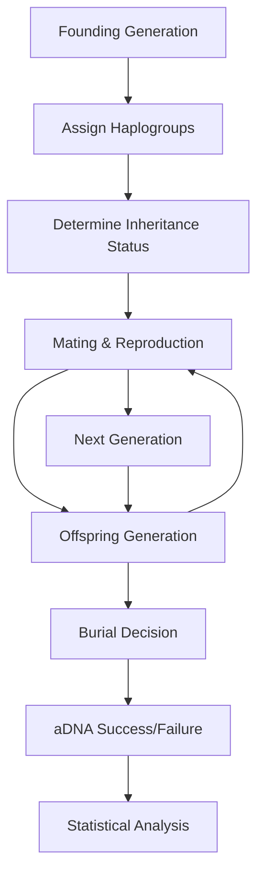
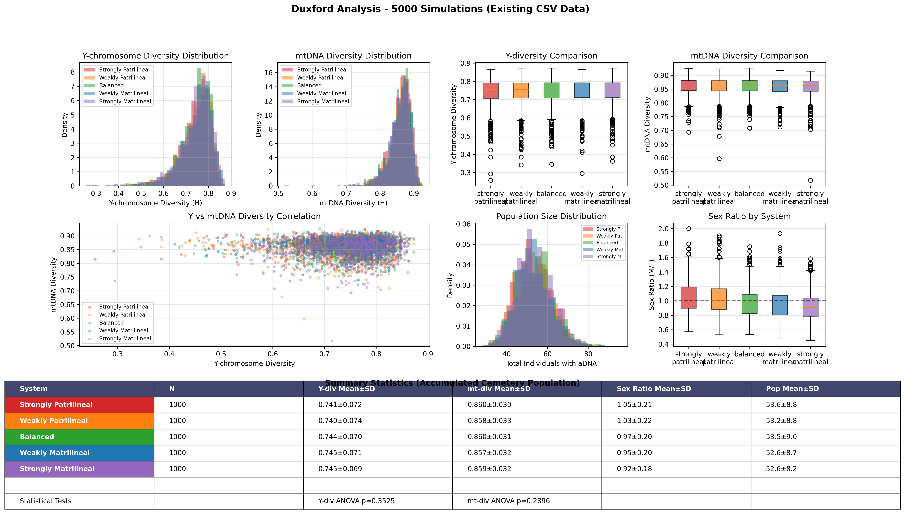

# Agent-Based Simulation for Inheritance Pattern Analysis

## Data Preparation

The archaeological aDNA data used in this analysis comes from the Cambridgeshire aDNA summary dataset available at: https://docs.google.com/spreadsheets/d/1t5xgyfdI6Ix_OLhg1c_x5VofATUbrhkw/edit?gid=759545336#gid=759545336

### Data Cleaning Process

The raw data (`single_dataset.csv`) undergoes the following cleaning steps using `clean_dataset.py`:

1. **Site Filtering**: Records from Arbury site are excluded from analysis
2. **Age Filtering**: Records with Adult column value "N" (non-adults) are removed
3. **Site Standardization**: Site ID values are simplified to 5 categories:
   - `Knobbs` (combines Knobbs 1, 2, and 3)
   - `NW_Cambridge` (Northwest Cambridge Site IV)
   - `Vicar_Farm` (Vicar's Farm)
   - `Fenstanton` (both Dairy Crest and Cambridge Road locations)
   - `Duxford`
4. **Column Removal**: Sex determination column is removed (we use DNA sex determination if possible, otherwise default to skeletal)
5. **Kinship Formatting**: "Sample ID for kin" values are converted to Python list format for easier parsing

To clean the data:
```bash
python clean_dataset.py single_dataset.csv > cleaned_dataset.csv
```

NB: The cleaned dataset stores kinship relationships in the "Sample ID for kin" column as string representations of Python lists. For example:
  - "[]" for no kinship
  - "['VIC016']" for single relationship
  - "['NWC007', 'NWC009', 'NWC004']" for multiple relationships

  When pandas reads the CSV, these values are loaded as strings, not actual Python lists. To convert them back to usable list objects, you use `ast.literal_eval()`:

```python
  import pandas as pd
  import ast

  df = pd.read_csv('cleaned_dataset.csv')
  kin_list = ast.literal_eval(df.iloc[0]['Sample ID for kin'])
```

## Overview

This document describes the agent-based model developed to test five inheritance systems against archaeological aDNA data from Roman-era Cambridgeshire sites. The model uses Approximate Bayesian Computation (ABC) to determine the most likely inheritance patterns for each archaeological site.


## Model Architecture

### Agent-Based Framework

The simulation models individual people as agents within a population over multiple generations. Each agent has:

- **Demographics**: Sex, age, generation
- **Genetics**: Y-chromosome and mtDNA haplogroups
- **Social Status**: Inheritance status, burial location
- **Relationships**: Parent-offspring, kinship networks

### Inheritance Systems Tested

In a patrilocal system, men stay put and women move in → within a cemetery you expect low Y-chr diversity, higher mtDNA diversity.
In a matrilocal system, women stay and men move in → low mtDNA diversity, higher Y-chr diversity.

1. **Strongly Patrilineal** (90% male inheritance)
   - Theoretical prediction: Y-diversity = 0, high mtDNA diversity
   - Expected kinship: Many father-son pairs, few female-female relationships

2. **Weakly Patrilineal** (70% male inheritance)
   - Mixed pattern with patrilineal bias

3. **Balanced** (50% male/female inheritance)
   - Equal inheritance opportunities regardless of sex

4. **Weakly Matrilineal** (70% female inheritance)
   - Mixed pattern with matrilineal bias

5. **Strongly Matrilineal** (90% female inheritance)
   - Theoretical prediction: Y-diversity = 1, low mtDNA diversity
   - Expected kinship: Many mother-daughter pairs, few male-male relationships

## Implementation Details

### Configuration Files

The model uses two configuration files to manage parameters:

#### Site-Specific Parameters (`site_parameters.py`)
Population sizes per generation based on archaeological evidence:

```python
SITE_PARAMETERS = {
    'Duxford': {'population_per_generation': 25},      # 20-30 people
    'NW_Cambridge': {'population_per_generation': 25}, # 20-30 people
    'Vicar_Farm': {'population_per_generation': 40},   # 30-50 people
    'Fenstanton': {'population_per_generation': 30},   # up to 30 people
    'Knobbs': {'population_per_generation': 40}        # 30-50 people
}
```

#### Global Parameters (`global_parameters.py`)
Simulation-wide settings and ABC configuration:

```python
# Burial and preservation
BURIAL_PROBABILITY = 0.8    # Probability of burial in cemetery
ADNA_SUCCESS_RATE = 0.7     # DNA extraction success rate

# ABC model selection
ABC_ACCEPTANCE_QUANTILE = 0.05  # Top 5% of simulations accepted
DEFAULT_SIMULATIONS_PER_SYSTEM = 100

# Distance weights for ABC comparison
DISTANCE_WEIGHTS = {
    'y_diversity': 2.0,           # High importance - genetic discriminator
    'mt_diversity': 2.0,          # High importance - genetic discriminator
    'prop_father_son': 1.5,       # Medium - kinship evidence
    'prop_mother_daughter': 1.5,  # Medium - kinship evidence
    'sex_ratio': 1.0,             # Standard - demographic info
    # ... additional weights
}

# Inheritance system definitions (male_prob = 1 - female_prob)
INHERITANCE_SYSTEMS = {
    'strongly_patrilineal': {'female_prob': 0.1},   # 90% male, 10% female
    'weakly_patrilineal': {'female_prob': 0.3},     # 70% male, 30% female
    'balanced': {'female_prob': 0.5},               # 50% male, 50% female
    'weakly_matrilineal': {'female_prob': 0.7},     # 30% male, 70% female
    'strongly_matrilineal': {'female_prob': 0.9}    # 10% male, 90% female
}
```

### Detailed Simulation Mechanics

Our agent-based model simulates inheritance patterns in **bounded Roman-era settlements** using a **fixed-size population model**. This approach models cemetery sites as representing stable communities with limited capacity, rather than growing lineages.

#### **Bounded Settlement Model**

The simulation uses a **"closed, fixed-size" population model** that:

1. **Maintains stable population size** each generation (25-40 individuals per site)
2. **Regulates population growth** through mortality and emigration
3. **Samples burials from living population** rather than tracking all lineages
4. **Models realistic demographic turnover** in bounded archaeological sites

This approach is archaeologically appropriate because:
- Cemetery sites represent settlements with **known capacity constraints**
- We study **relative inheritance patterns**, not population growth dynamics
- Roman-era farmsteads and villages had **stable occupancy** over time
- Avoids unrealistic population explosions that would swamp inheritance signals

#### **Population Dynamics**

1. **Target Population Size** - Site-specific values from archaeological evidence:
   - Duxford: 25 individuals per generation (small farmstead)
   - NW Cambridge: 25 individuals per generation (small farm)
   - Vicar's Farm: 40 individuals per generation (large farm)
   - Fenstanton: 30 individuals per generation (specialist farm)
   - Knobbs: 40 individuals per generation (large farm complex)

2. **Generation Turnover** - 15-year cycles with:
   - **Age-based mortality**: 5% (young adults) to 80% (elderly)
   - **Reproduction**: Individuals aged 15-55 (males) / 15-50 (females)
   - **Population regulation**: Excess individuals emigrate; shortfalls occur naturally

3. **Inheritance System Probabilities** - The core experimental variables:
   - Strongly patrilineal: 90% male, 10% female inheritance
   - Weakly patrilineal: 70% male, 30% female inheritance
   - Balanced: 50% male, 50% female inheritance
   - Weakly matrilineal: 30% male, 70% female inheritance
   - Strongly matrilineal: 10% male, 90% female inheritance

4. **Migration assumption** - **NONE**: Closed population model (no external gene flow)

#### **Fixed Parameters**

1. **Offspring production** - Each mating pair produces offspring drawn from a normal distribution with mean = 2.5 children and standard deviation = 1.0, rounded to nearest integer

2. **Mating probability** - 80% chance that eligible adults (age ≥16) successfully mate within their generation

3. **Burial sampling rate** - ~20% of living population per generation gets buried (representing deaths/turnover)

4. **aDNA success rate** - 70% chance of successful DNA extraction from buried individuals

#### **Bounded Settlement Simulation Process**

**Step 1: Initialize Founding Generation**
- Create founding population (25-40 individuals) with diverse Y-chromosome and mtDNA haplogroups
- Assign inheritance status to individuals based on inheritance system probabilities
- Set initial ages (25-45 years) for founding adults

**Step 2: Generational Turnover** (repeated for 4 generations, 15-year cycles)
- **Aging and mortality**: All individuals age by 15 years with age-dependent mortality (5-80%)
- **Reproduction**: Eligible adults (15-55 male, 15-50 female) form pairs with 80% success rate
- **Offspring production**: Each successful pair produces children (normal distribution, mean=2.5)
- **Haplogroup inheritance**: Children inherit mtDNA from mother, Y-chromosome from father (if male)
- **Inheritance determination**: Children receive inheritance status based on system probabilities
- **Population regulation**: Combined survivors + offspring regulated to target population size:
  - **Selection criteria**: Inheritance status, reproductive age, sex balance
  - **Excess emigration**: Surplus individuals leave the settlement
  - **Natural variation**: Population may be below target (realistic for small communities)

**Step 3: Burial Sampling from Living Population**
- **Generational sampling**: ~20% of living population sampled for burial each generation
- **Selection weights**: Older individuals and inheritors more likely to be buried locally
- **aDNA extraction**: 70% of buried individuals yield successful genetic data
- **Missing data creation**: Failed extractions result in `NaN` haplogroup values

**Step 4: Cemetery Accumulation and Analysis**
- **Multi-generational cemetery**: Burials accumulate across all 4 generations
- **Stable population base**: Analysis reflects bounded settlement rather than lineage explosion
- **Realistic sample sizes**: 20-50 total burials per site (matching archaeological reality)

**Step 4: Statistical Analysis**
- Calculate Nei's haplotype diversity for Y-chromosome and mtDNA: `H = (n/(n-1)) * (1 - Σp²)`
- Analyze kinship patterns (father-son, mother-daughter ratios)
- Compute sex ratios and demographic statistics
- Generate summary statistics for ABC comparison

#### **Key Model Features**

**Realistic Missing Data**: The two-stage process (burial → aDNA success) creates ~44% missing genetic data, matching archaeological reality where many individuals lack genetic information.

**Inheritance-Driven Patterns**: Different inheritance systems produce distinct genetic signatures:
- **Patrilineal**: Low Y-chromosome diversity (few male lineages), higher mtDNA diversity (many female lineages)
- **Matrilineal**: High Y-chromosome diversity (many male lineages), lower mtDNA diversity (few female lineages)
- **Balanced**: Intermediate diversity levels for both marker types

**No Migration**: Following archaeological guidance, the model assumes closed populations with no external migration, focusing purely on inheritance pattern effects.

**Agent Lifecycle Overview**



### Missing Data and aDNA Success Modeling

The simulation realistically models missing genetic data that characterizes ancient DNA research:

#### Two-Stage Missing Data Process

1. **Burial Simulation** (`BURIAL_PROBABILITY = 0.8`)
   - 80% chance individual gets preserved in archaeological record
   - Accounts for taphonomic processes and site formation

2. **aDNA Extraction Simulation** (`ADNA_SUCCESS_RATE = 0.7`)
   - 70% chance DNA extraction succeeds from buried individual
   - Models realistic ancient DNA preservation rates

**Overall Genetic Data Availability**: `0.8 × 0.7 = 56%` of all simulated individuals have haplogroup data

#### Missing Data Handling in Observed Archaeological Data

**Data Cleaning Process** (`data_preprocessing.py:105-124`):
```python
def _clean_haplogroup(self, series: pd.Series) -> pd.Series:
    # Mark invalid/missing data patterns as np.nan
    invalid_patterns = [
        'too low coverage', 'unknown', 'nan', 'untested',
        '#n/a', 'n/a', '', 'none'
    ]
    # Standardized missing data representation
    cleaned = cleaned.replace('', np.nan)
```

**Statistical Calculations** automatically exclude missing values:
- **Y-chromosome diversity**: `y_valid = site_data['y_chr_clean'].dropna()`
- **mtDNA diversity**: `mt_valid = site_data['mt_dna_clean'].dropna()`
- **Kinship analysis**: Only individuals with valid haplogroup data contribute

#### Simulation Implementation

**aDNA Success Determination** (`agent_simulation.py:245-246`):
```python
if self._simulate_adna_success():  # Uses ADNA_SUCCESS_RATE
    adna_successful.append(individual)
```

**Missing Data Creation** (`agent_simulation.py:267-268`):
```python
'Y_Haplogroup': ind.y_haplogroup if has_adna else np.nan,
'mt_Haplogroup': ind.mt_haplogroup if has_adna else np.nan,
```

This creates realistic missing data patterns (~44% missing genetic data) that mirror archaeological reality, where many individuals lack genetic data due to poor preservation or failed extraction.

### Key Statistics Calculated

#### Haplotype Diversity (Nei's Formula)
```
H = (n/(n-1)) * (1 - Σp²)
```
Where n = sample size, p = frequency of each haplogroup

#### Kinship Relationship Ratios
- Father-son pairs / total relationships
- Mother-daughter pairs / total relationships
- Same-sex vs cross-sex kinship patterns
- Male vs female kinship frequency

#### Population Structure Metrics
- Sex ratios in burials
- Inheritance patterns by sex
- Haplogroup sharing within sites

## Running the Analysis

### Command-Line Interface

The main analysis script supports flexible execution options:

```bash
# Usage: python run_full_analysis.py [iterations] [site_name]

# Examples:
python run_full_analysis.py                    # All sites, default iterations (100)
python run_full_analysis.py 50                 # All sites, 50 iterations
python run_full_analysis.py 200 Duxford        # Only Duxford, 200 iterations
```

**Available sites:**
- `Duxford` - Early Roman farmstead (100-125 CE)
- `NW_Cambridge` - Mid-Roman cemetery (150-250 CE)
- `Vicar_Farm` - Late Roman farm (270-420 CE)
- `Fenstanton` - Large farm complex (40-400 CE)
- `Knobbs` - Late Roman farm (275-400 CE)

### Quick Testing

For rapid testing and validation:

```bash
# Test single site with few iterations (fast)
python run_full_analysis.py 10 Duxford

# Test parameter changes
python run_full_analysis.py 25 "Vicar_Farm"
```

### Output Files

The analysis generates multiple CSV files for each site analyzed:

#### 1. Main Results (`abc_results_[site].csv`)
- Best inheritance system and evidence strength
- Posterior probabilities for all 5 systems
- Bayes factors for model comparison
- ABC acceptance statistics

#### 2. Site Statistics (`observed_stats_[site].csv`)
- Observed genetic diversity measures
- Kinship ratios (father-son, mother-daughter)
- Sex ratios and demographic data

#### 3. Simulation Data (`simulation_summaries_[site].csv`)
- Complete summary statistics for every simulation
- Organized by inheritance system and run ID
- Useful for validation and detailed analysis

#### 4. System Summaries (`system_aggregates_[site].csv`)
- Mean and standard deviation by inheritance system
- Statistical patterns across simulations

#### 5. Combined Analysis (when running all sites)
- `site_analysis_summary.csv` - Results for all sites
- `inheritance_analysis_visualization.png` - Charts and plots
- `inheritance_analysis_report.txt` - Detailed text report


### Data Requirements

Before running analysis, ensure you have:

1. **Raw data file**: `single_dataset.csv` (from Google Sheets source)
2. **Cleaned data**: Generate using `python clean_dataset.py single_dataset.csv > cleaned_dataset.csv`
3. **Python environment**: See requirements in repository

## ABC Model Selection Framework

### What is ABC Rejection Sampling?

ABC (Approximate Bayesian Computation) is a **likelihood-free** Bayesian method used when the likelihood function is intractable or too complex to compute directly. Instead of calculating exact probabilities, it uses **simulation-based inference**.

### Core ABC Algorithm

```python
# Step 1: Generate many simulations for each inheritance system
for system in ['strongly_patrilineal', 'weakly_patrilineal', 'balanced',
               'weakly_matrilineal', 'strongly_matrilineal']:
    for i in range(100):  # 100 simulations per system
        simulation_result = run_simulation(system)
        sim_statistics = calculate_summary_statistics(simulation_result)

        # Step 2: Calculate distance from observed data
        distance = calculate_distance(sim_statistics, observed_statistics)

        # Store results
        distances.append(distance)
        systems.append(system)
```

### Distance Calculation

The model compares simulated statistics to observed archaeological data using **weighted Euclidean distance**:

```python
def calculate_distance(sim_stats, obs_stats, weights):
    distance = 0.0
    total_weight = 0.0
    for key, weight in weights.items():
        if key in both datasets:
            # Normalize by observed value to handle different scales
            if obs_stats[key] != 0:
                normalized_diff = abs(sim_stats[key] - obs_stats[key]) / abs(obs_stats[key])
            else:
                normalized_diff = abs(sim_stats[key])
            distance += weight * normalized_diff
            total_weight += weight
    return distance / total_weight
```

**Key statistics compared with weights (from `global_parameters.py`):**
- `y_diversity`: Y-chromosome diversity (weight = 2.0) - Primary genetic discriminator
- `mt_diversity`: mtDNA diversity (weight = 2.0) - Complementary genetic signal
- `prop_father_son`: Father-son relationship ratio (weight = 1.5) - Direct kinship evidence
- `prop_mother_daughter`: Mother-daughter relationship ratio (weight = 1.5) - Direct kinship evidence
- `sex_ratio`: Male/female burial ratio (weight = 1.0) - Demographic information
- `prop_y_matches`: Y-chromosome sharing in kinship pairs (weight = 1.0) - Quality control
- `prop_mt_matches`: mtDNA sharing in kinship pairs (weight = 1.0) - Quality control
- `prop_inheritors`: Inheritance frequency (weight = 0.5) - Model artifact

### Rejection Step

```python
# Step 3: Accept only the closest simulations
epsilon = np.quantile(distances, 0.05)  # Accept top 5% of simulations
accepted_mask = distances <= epsilon
accepted_systems = systems[accepted_mask]
```

**In our analysis:**
- **500 total simulations** per site (100 per inheritance system)
- **25 simulations accepted** (5% acceptance rate)
- **ε (epsilon) threshold** = 5th percentile of distances

### Posterior Probability Calculation

```python
# Step 4: Calculate posterior probabilities from accepted simulations
for system in unique_systems:
    # Count how many accepted simulations came from each system
    count = np.sum(accepted_systems == system)
    # Posterior = proportion of accepted simulations from this system
    posteriors[system] = count / len(accepted_systems)
```


### Why ABC Rejection Sampling?

#### Advantages:
1. **Model-free**: No need to specify complex likelihood functions
2. **Flexible**: Can incorporate any summary statistics
3. **Realistic**: Uses full simulation model with all complexities
4. **Interpretable**: Direct comparison of simulation outputs to data

#### Challenges:
1. **Computational cost**: Requires many simulations
2. **Curse of dimensionality**: Performance degrades with many statistics
3. **Choice of summary statistics**: Must capture relevant patterns
4. **Acceptance rate**: Too strict = few samples, too loose = poor approximation

### Example: Duxford Site Analysis

```
python run_full_analysis.py 1000 Duxford 
================================================================================
CAMBRIDGE ARCHAEOLOGY INHERITANCE PATTERN ANALYSIS
================================================================================

Initializing analysis framework...

Running analysis for: Duxford
Simulations per system: 1000

Analyzing Duxford with 1000 simulations per system...

============================================================
ANALYZING SITE: Duxford
============================================================
Running 1000 simulations per system for Duxford...
  Using site-specific population: 25 per generation
  Simulating strongly_patrilineal...
  Completed 1000 successful simulations for strongly_patrilineal
  Simulating weakly_patrilineal...
  Completed 1000 successful simulations for weakly_patrilineal
  Simulating balanced...
  Completed 1000 successful simulations for balanced
  Simulating weakly_matrilineal...
  Completed 1000 successful simulations for weakly_matrilineal
  Simulating strongly_matrilineal...
  Completed 1000 successful simulations for strongly_matrilineal
Running ABC analysis for Duxford...

RESULTS FOR Duxford
----------------------------------------
Accepted 250/5000 simulations
Distance threshold (ε): 0.1665

Best supported system: strongly_matrilineal
Posterior probability: 0.252
Evidence strength: Inconclusive

Posterior probabilities:
  balanced            : 0.224
  strongly_matrilineal: 0.252
  strongly_patrilineal: 0.200
  weakly_matrilineal  : 0.136
  weakly_patrilineal  : 0.188

Bayes factors:
  balanced            : 1.12
  strongly_matrilineal: 1.26
  strongly_patrilineal: 1.00
  weakly_matrilineal  : 0.68
  weakly_patrilineal  : 0.94

Results saved to CSV files:
  - abc_results_Duxford.csv (main ABC results)
  - observed_stats_Duxford.csv (observed site statistics)
  - simulation_summaries_Duxford.csv (simulation summaries)
  - system_aggregates_Duxford.csv (aggregated statistics by system)

================================================================================
RESULTS FOR Duxford
================================================================================
Best inheritance system: strongly_matrilineal
Posterior probability: 0.252
Evidence strength: Inconclusive
ABC acceptance rate: 250/5000 = 5.0%

Posterior probabilities for all systems:
  balanced                 : 0.224
  strongly_matrilineal     : 0.252
  strongly_patrilineal     : 0.200
  weakly_matrilineal       : 0.136
  weakly_patrilineal       : 0.188

================================================================================
ANALYSIS COMPLETE!
================================================================================

Results saved as CSV files:
  - abc_results_Duxford.csv (main results)
  - observed_stats_Duxford.csv (site statistics)
  - simulation_summaries_Duxford.csv (all simulations)
  - system_aggregates_Duxford.csv (summary by system)
```



## Technical Implementation

### Core Modules

1. **`data_preprocessing.py`** - Site data cleaning and standardization
2. **`inheritance_statistics.py`** - Statistical measures and pattern classification
3. **`agent_simulation.py`** - Agent-based population modeling
4. **`hypothesis_testing.py`** - ABC framework and model comparison
5. **`run_full_analysis.py`** - Complete analysis pipeline

### Validation & Testing

TODO 

## Limitations and Future Work

### Current Limitations

1. **Sample Size**: Many sites have limited aDNA samples
2. **Temporal Resolution**: Cannot distinguish inheritance changes over time
3. **Closed Population**: Assumes no external migration or gene flow

### Future Improvements

1. **Temporal Modeling**: Multi-phase simulations for chronological changes
2. **Spatial Analysis**: Regional inheritance pattern modeling
3. **Environmental Factors**: Climate and resource effects on social organization
4. **Integration**: Combine with isotope, artifact, and burial data

## References

### Core ABC Methodology References

#### Foundational Papers:

1. **Beaumont, M. A., Zhang, W., & Balding, D. J. (2002)**
   - *"Approximate Bayesian computation in population genetics"*
   - **Genetics, 162(4), 2025-2035**
   - **Link**: https://doi.org/10.1093/genetics/162.4.2025
   - **Key**: Original ABC framework for population genetics

2. **Csilléry, K., Blum, M. G., Gaggiotti, O. E., & François, O. (2010)**
   - *"Approximate Bayesian Computation (ABC) in practice"*
   - **Trends in Ecology & Evolution, 25(7), 410-418**
   - **Link**: https://doi.org/10.1016/j.tree.2010.04.001
   - **Key**: Practical ABC guide with applications

3. **Sunnåker, M., Busetto, A. G., Numminen, E., Corander, J., Foll, M., & Dessimoz, C. (2013)**
   - *"Approximate Bayesian computation"*
   - **PLoS Computational Biology, 9(1), e1002803**
   - **Link**: https://doi.org/10.1371/journal.pcbi.1002803
   - **Key**: Comprehensive ABC tutorial and review

#### ABC in Archaeological Genetics:

4. **Excoffier, L., Dupanloup, I., Huerta-Sánchez, E., Sousa, V. C., & Foll, M. (2013)**
   - *"Robust demographic inference from genomic and SNP data"*
   - **PLoS Genetics, 9(10), e1003905**
   - **Link**: https://doi.org/10.1371/journal.pgen.1003905
   - **Key**: ABC for demographic inference in ancient populations

5. **Raynal, L., Marin, J. M., Pudlo, P., Ribatet, M., Robert, C. P., & Estoup, A. (2019)**
   - *"ABC random forests for Bayesian parameter inference"*
   - **Bioinformatics, 35(10), 1720-1728**
   - **Link**: https://doi.org/10.1093/bioinformatics/bty867
   - **Key**: Modern ABC methods with machine learning

#### Kinship & Social Structure:

6. **Monroy Kuhn, J. M., Jakobsson, M., & Günther, T. (2018)**
   - *"Estimating genetic kin relationships in prehistoric populations"*
   - **PLoS One, 13(4), e0195491**
   - **Link**: https://doi.org/10.1371/journal.pone.0195491
   - **Key**: Kinship estimation methods in ancient DNA

7. **Scheib, C. L., Hui, R., Rose, A. K., D'Atanasio, E., Inskip, S. A., Dittmar, J., ... & Kivisild, T. (2024)**
   - *"Low Genetic Impact of the Roman Occupation of Britain in Rural Communities"*
   - **Molecular Biology and Evolution, 41(9), msae168**
   - **Link**: https://doi.org/10.1093/molbev/msae168
   - **Key**: Source of the Cambridge archaeological aDNA data analyzed

#### Population Genetics Theory:

8. **Nei, M. (1987)**
   - *"Molecular evolutionary genetics"*
   - **Columbia University Press**
   - **Key**: Theoretical foundation for haplotype diversity measures

9. **Haak, W., Lazaridis, I., Patterson, N., Rohland, N., Mallick, S., Llamas, B., ... & Reich, D. (2015)**
   - *"Massive migration from the steppe was a source for Indo-European languages in Europe"*
   - **Nature, 522(7555), 207-211**
   - **Link**: https://doi.org/10.1038/nature14317
   - **Key**: Large-scale ancient DNA population studies methodology

### Software & Implementation:

- **ABCtoolbox**: https://github.com/abctools/abctoolbox
- **PyABC**: https://pyabc.readthedocs.io/
- **abc package in R**: https://cran.r-project.org/web/packages/abc/index.html

---

*Analysis completed using Python implementation with configurable simulations per site (default 100, up to 500+ for publication results) and ABC model selection framework. Results are saved as CSV files for easy analysis and sharing. Full source code and data available in this repository.*