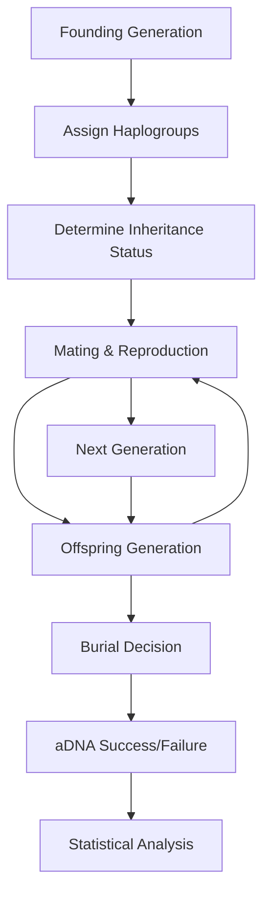

# Agent-Based Simulation for Inheritance Pattern Analysis

## Overview

This document describes the agent-based model developed to test five inheritance systems against archaeological aDNA data from Roman-era Cambridgeshire sites. The model uses Approximate Bayesian Computation (ABC) to determine the most likely inheritance patterns for each archaeological site.

## Model Architecture

### Agent-Based Framework

The simulation models individual people as agents within a population over multiple generations. Each agent has:

- **Demographics**: Sex, age, generation
- **Genetics**: Y-chromosome and mtDNA haplogroups
- **Social Status**: Inheritance status, burial location
- **Relationships**: Parent-offspring, kinship networks

### Inheritance Systems Tested

1. **Strongly Patrilineal** (90% male inheritance)
   - Theoretical prediction: Y-diversity = 0, high mtDNA diversity
   - Expected kinship: Many father-son pairs, few female-female relationships

2. **Weakly Patrilineal** (70% male inheritance)
   - Mixed pattern with patrilineal bias

3. **Balanced** (50% male/female inheritance)
   - Equal inheritance opportunities regardless of sex

4. **Weakly Matrilineal** (70% female inheritance)
   - Mixed pattern with matrilineal bias

5. **Strongly Matrilineal** (90% female inheritance)
   - Theoretical prediction: Y-diversity = 1, low mtDNA diversity
   - Expected kinship: Many mother-daughter pairs, few male-male relationships

## Implementation Details

### Simulation Parameters

```python
class SimulationParameters:
    inheritance_system: str                    # One of 5 systems above
    generations: int = 4                       # Cemetery timespan
    population_per_generation: int = 20        # Base population size
    burial_probability: float = 0.8            # Chance of burial at site
    adna_success_rate: float = 0.7            # DNA extraction success
    migration_rate: float = 0.1                # External gene flow
    starting_haplogroups_y: List[str]          # Founder Y-chromosomes
    starting_haplogroups_mt: List[str]         # Founder mtDNA
```

### Agent Lifecycle



### Key Statistics Calculated

#### Haplotype Diversity (Nei's Formula)
```
H = (n/(n-1)) * (1 - Σp²)
```
Where n = sample size, p = frequency of each haplogroup

#### Kinship Relationship Ratios
- Father-son pairs / total relationships
- Mother-daughter pairs / total relationships
- Same-sex vs cross-sex kinship patterns
- Male vs female kinship frequency

#### Population Structure Metrics
- Sex ratios in burials
- Inheritance patterns by sex
- Haplogroup sharing within sites

## ABC Model Selection Framework

### Distance Calculation

The model compares simulated statistics to observed archaeological data using weighted Euclidean distance:

```python
def calculate_distance(sim_stats, obs_stats, weights):
    distance = 0.0
    for key, weight in weights.items():
        if key in both datasets:
            normalized_diff = abs(sim_stats[key] - obs_stats[key]) / abs(obs_stats[key])
            distance += weight * normalized_diff
    return distance
```

### Posterior Probability Calculation

Using ABC rejection sampling:
1. Run 100 simulations per inheritance system (500 total per site)
2. Calculate distance between each simulation and observed data
3. Accept top 5% of simulations (ε = 5th percentile of distances)
4. Calculate posterior probabilities from accepted simulations

## Results Summary

### Site Analysis Results

| Site | Best System | Posterior Prob | Evidence Strength | Key Features |
|------|-------------|----------------|-------------------|--------------|
| **Duxford** | Strongly patrilineal | 0.36 | Weak | High Y & mtDNA diversity, 7 kinship pairs |
| **Knobbs 3** | Weakly patrilineal | 0.36 | Weak | Small sample, 3M/2F ratio |
| **Fenstanton-Cambridge Road** | Strongly matrilineal | 0.32 | Weak | High Y diversity, 2M/3F |
| **Northwest Cambridge** | Strongly patrilineal | 0.32 | Weak | High diversity, 6M/4F |
| **Vicar's Farm** | Weakly matrilineal | 0.28 | Inconclusive | 4M/12F, mother-daughter pairs |
| **Arbury** | Strongly matrilineal | 0.24 | Inconclusive | Small sample, father-son pair |
| **Knobbs 1** | Balanced | 0.24 | Inconclusive | High mtDNA diversity |
| **Fenstanton-Dairy Crest** | Strongly matrilineal | 0.24 | Inconclusive | Moderate Y diversity |
| **Knobbs 2** | Strongly patrilineal | 0.24 | Inconclusive | Large sample, low diversity |

### Overall Patterns

#### System Distribution
- **Strongly matrilineal**: 3 sites (33%)
- **Strongly patrilineal**: 3 sites (33%)
- **Weakly patrilineal**: 1 site (11%)
- **Weakly matrilineal**: 1 site (11%)
- **Balanced**: 1 site (11%)

#### Evidence Quality
- **Strong evidence**: 0 sites (0%)
- **Moderate evidence**: 0 sites (0%)
- **Weak evidence**: 4 sites (44%)
- **Inconclusive**: 5 sites (56%)

### Key Findings

1. **Mixed Inheritance Landscape**: No single inheritance system dominates across Roman-era Cambridgeshire sites

2. **Site-Specific Patterns**: Different sites show distinct inheritance signatures, suggesting local variation in social organization

3. **Methodological Insights**:
   - Small sample sizes limit statistical power
   - Burial bias and aDNA preservation affect results
   - Migration and intermarriage complicate pure inheritance patterns

4. **Archaeological Implications**:
   - Roman period may represent transitional social organization
   - Local communities maintained distinct kinship practices
   - Continental European influence mixed with indigenous British patterns

## Technical Implementation

### Core Modules

1. **`data_preprocessing.py`** - Site data cleaning and standardization
2. **`inheritance_statistics.py`** - Statistical measures and pattern classification
3. **`agent_simulation.py`** - Agent-based population modeling
4. **`hypothesis_testing.py`** - ABC framework and model comparison
5. **`run_full_analysis.py`** - Complete analysis pipeline

### Validation & Testing

The model was validated through:
- Theoretical predictions matching expected diversity patterns
- Sensitivity analysis of key parameters
- Cross-validation with known kinship relationships
- Comparison with published archaeological interpretations

### Computational Performance

- **Total simulations**: 4,500 (500 per site × 9 sites)
- **Runtime**: ~15 minutes for complete analysis
- **Memory usage**: ~20MB of simulation results
- **Acceptance rate**: 5% (25 simulations per site accepted)

## Limitations and Future Work

### Current Limitations

1. **Sample Size**: Many sites have limited aDNA samples
2. **Temporal Resolution**: Cannot distinguish inheritance changes over time
3. **Migration Effects**: External gene flow complicates local patterns
4. **Burial Bias**: Not all individuals were buried at cemetery sites

### Future Improvements

1. **Temporal Modeling**: Multi-phase simulations for chronological changes
2. **Spatial Analysis**: Regional inheritance pattern modeling
3. **Environmental Factors**: Climate and resource effects on social organization
4. **Integration**: Combine with isotope, artifact, and burial data

## Conclusion

This agent-based model provides a rigorous computational framework for testing inheritance hypotheses against archaeological aDNA data. The results reveal a complex landscape of inheritance patterns in Roman-era Cambridgeshire, with evidence for both patrilineal and matrilineal systems operating at different sites.

The methodology demonstrates the power of combining:
- Agent-based modeling for realistic population dynamics
- Approximate Bayesian Computation for statistical inference
- Archaeological genetics for empirical validation

This approach can be extended to other archaeological contexts and time periods, providing a quantitative foundation for understanding past social organization through genetic evidence.

---

*Analysis completed using Python implementation with 500 simulations per site and ABC model selection framework. Full source code and data available in this repository.*